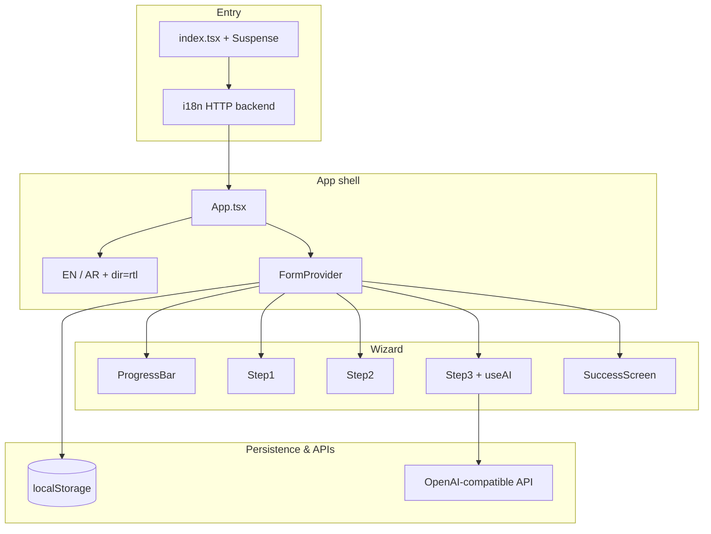

# Architecture & design notes

Short overview of how the Social Support app is structured, why key choices were made, and sensible next steps.

## High-level flow

1. **Bootstrap** — `index.tsx` loads `i18n` (async JSON from `public/locals/`) inside `Suspense`, then renders `App`.
2. **Shell** — Header, language toggle, and `FormProvider` wrap the wizard.
3. **Steps** — One react-hook-form instance for all fields; each step validates its own field list before advancing.
4. **Submit** — Mock delay + generated reference number; saved draft cleared from `localStorage`.

## Source layout

| Area | Role |
|------|------|
| `src/App.tsx` | Layout, language toggle (`dir` / `lang` on `<html>`), step routing |
| `src/context/FormContext.tsx` | Wizard state, RHF provider, `localStorage`, mock submission |
| `src/components/Step*.tsx` | Step UI and per-step validation via `trigger()` |
| `src/components/FormField.tsx` | Shared label + error display |
| `src/components/AISuggestionModal.tsx` | Review / edit / accept AI draft |
| `src/hooks/useAI.ts` | Chat API calls and loading/error state per field |
| `src/config/api.ts` | `REACT_APP_*` env accessors |
| `src/types/` | `FormData`, step field lists, AI result types |
| `src/i18n/index.ts` | i18next + HTTP backend + `react-i18next` |
| `public/locals/*.json` | Translation files (editable without rebuild) |
| `src/test/test-utils.tsx` | Test-only i18n instance (no HTTP / Suspense) |

## Key decisions

### Create React App (no eject)

Keeps setup familiar and fast for an assignment-sized app. Trade-off: less flexibility than Vite for bundling and env handling.

### Single form instance across all steps

**react-hook-form** holds one `FormData` object for the whole wizard. Steps only render a subset of fields; navigation uses `trigger(STEPn_FIELDS)` so validation is scoped per step without losing values when going back.

**Why:** Simpler than three separate forms or lifting every field into manual `useState`. Progress saves one JSON blob to `localStorage`.

### `FormContext` + RHF `FormProvider`

Custom context owns wizard metadata (current step, submitted, reference number, save banner). It nests RHF’s `FormProvider` so steps use `useFormContext<FormData>()` for `register` / `errors`.

**Why:** Separates “where am I in the wizard?” from “what are the field values?” without prop drilling.

### i18n via HTTP backend

Translations live in `public/locals/en.json` and `ar.json`, loaded at runtime. Copy can change without redeploying JS (only static assets).

**Why:** Matches bilingual requirement; editors can update JSON directly. Tests use a separate in-memory i18n instance in `test-utils.tsx` to avoid Suspense and network in Jest.

### AI on the client

`useAI` calls an OpenAI-compatible endpoint from the browser using `REACT_APP_AI_API_KEY`. Step 3 disables “Help me write” when the key is missing.

**Why:** No backend required for the assignment. **Trade-off:** Keys are exposed in the client bundle — acceptable for demos; production should use a server proxy.

### OpenRouter as default URL

`getAiApiUrl()` defaults to OpenRouter; direct OpenAI is a one-line env override. Same request shape (`Bearer` + chat completions).

### Accessibility & RTL

- Labels tied with `htmlFor` / `id`; errors use `role="alert"`.
- Arabic sets `document.documentElement.dir = 'rtl'` and `lang`.
- Progress and language controls use appropriate ARIA attributes.

### Mock submission

`submitForm` waits 1.5s and generates `SSP-<timestamp>` — no real government API. Clears draft storage on success.

## Testing approach

- **Unit tests** for context, `useAI` (mocked `axios`), config helpers, and main UI flows.
- **`renderWithProviders`** wraps components with test i18n + `FormProvider`.
- **user-event v14** `setup()` for realistic interactions.

## Possible improvements

| Area | Idea |
|------|------|
| **Security** | Backend route that holds the API key; rate limiting and audit logging |
| **i18n** | Type-safe keys (e.g. `i18next` resource typing); fix folder name `locals` → `locales` |
| **Validation** | Shared Zod/Yup schema mirroring `FormData` for reuse in tests and a future API |
| **Persistence** | Debounce `localStorage` writes; optional encryption or session-only storage |
| **UX** | Confirm before leaving step with dirty fields; keyboard focus management on step change |
| **AI** | Stream tokens into the modal; model name from env; remove debug `console.log` in `useAI` |
| **Build** | Migrate to Vite for faster dev and clearer env story |
| **Submission** | POST `FormData` to a real endpoint; show server validation errors |
| **E2E** | Playwright/Cypress for full wizard + language switch |

## Related docs

- [README.md](./README.md) — run instructions and API key setup
